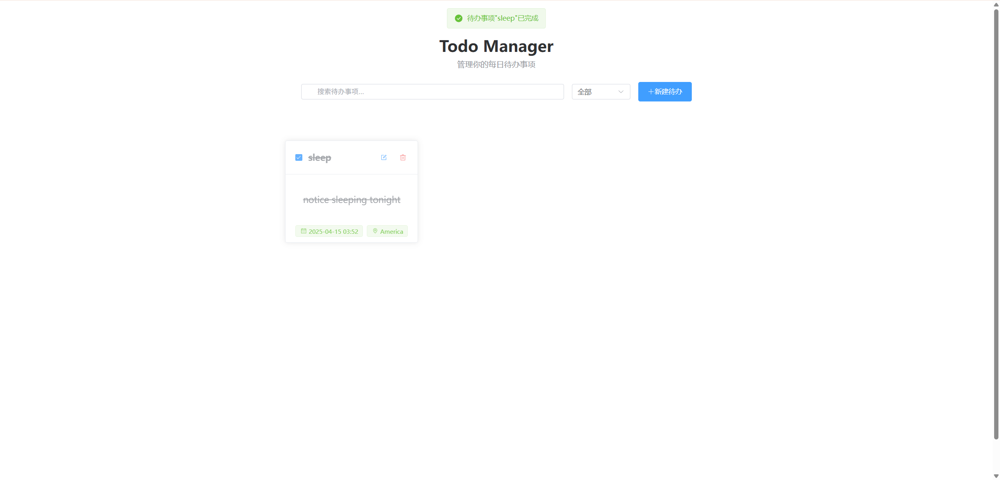

# ✅ Todo Manager

一个简洁美观的待办事项管理应用，帮助您高效管理日常任务。

## ✨ 项目特点

- 🎨 美观的卡片式界面设计
- ✍️ 支持创建、编辑、删除和完成待办事项
- 🔍 可按状态（全部/未完成/已完成）筛选待办事项
- 🔎 支持关键词搜索功能
- 💾 本地存储保存数据，无需登录即可使用
- 📱 响应式设计，支持各种屏幕尺寸

## 📚 功能介绍

### 📝 创建待办事项

点击右上角的"新建待办"按钮，填写待办事项的标题、描述、日期、时间和地点信息。其中标题、日期和时间为必填项。

### ⚡ 管理待办事项

- 👀 **查看**：所有待办事项以卡片形式显示在主界面
- ✅ **完成**：点击待办事项卡片左上角的复选框可标记为已完成/未完成
- 📝 **编辑**：点击卡片右上角的编辑图标可修改待办事项内容
- 🗑️ **删除**：点击卡片右上角的删除图标可删除待办事项

### 🔍 筛选与搜索

- 📊 使用顶部的状态下拉框可按"全部"、"未完成"或"已完成"筛选待办事项
- 🔎 使用搜索框可根据标题、描述或地点关键词搜索待办事项

## 🛠️ 技术栈

- ⚡ Vue 3 (组合式 API)
- 🎨 Element Plus UI 组件库
- ⏰ dayjs 日期处理库
- 💾 本地存储 (localStorage)

## 📦 使用方法

1. 克隆仓库到本地

```
git clone https://github.com/zhouyu2156/todo-manager.git
```

2. 安装依赖

```
cd todo-manager
npm install
```

3. 启动开发服务器

```
npm run dev
```

4. 构建生产版本

```
npm run build
```

## 📸 项目截图



## 📄 许可证

MIT
